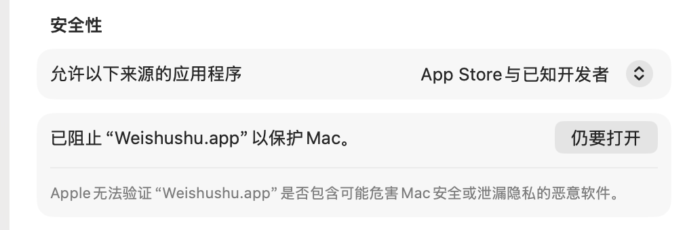
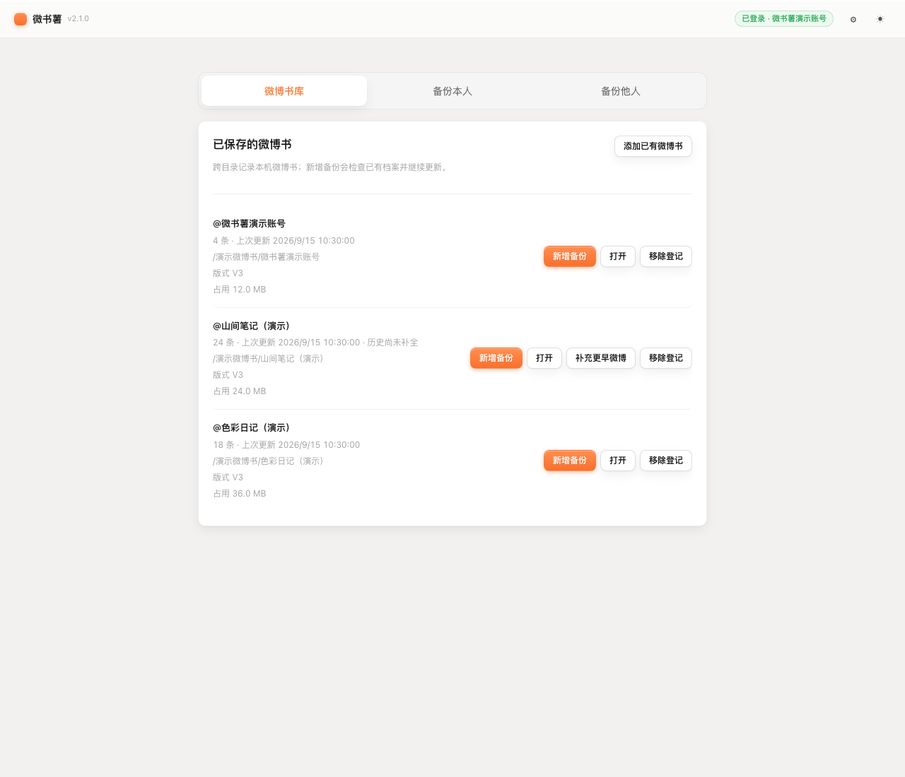
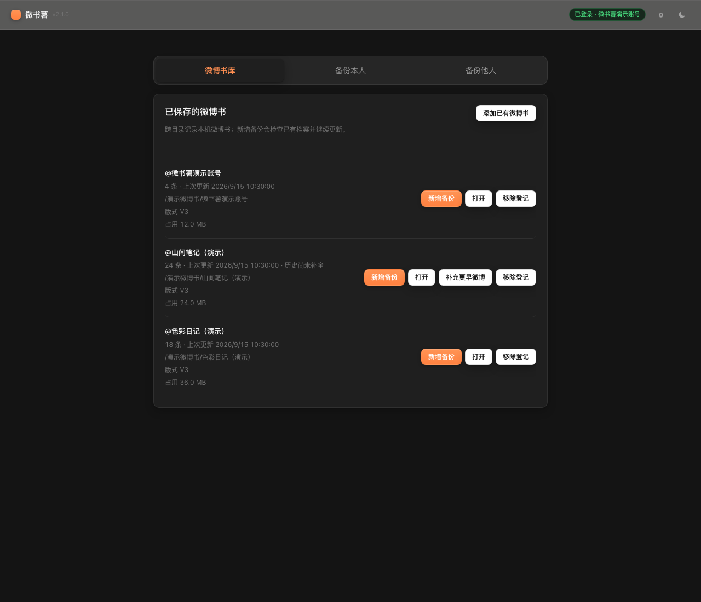

<div align="center">
  
  <h1>微书薯 Weishushu</h1>
  <p><strong>把你的微博，备份成一本可以永远保存的书</strong></p>
  <p>互动 HTML · PDF · Markdown · 本地媒体档案</p>
  <p>
    
    
    
    <a href="LICENSE"></a>
  </p>
  <p>
    <a href="https://github.com/Fairc11/weishushu/releases/latest">下载最新版本</a>　·　
    <a href="https://github.com/Fairc11/weishushu/releases">更新记录</a>　·　
    <a href="https://github.com/Fairc11/weishushu/issues">问题反馈</a>
  </p>
</div>

> **风险须知**：微书薯仅支持单设备、单进程、单登录状态的个人归档用途，使用前请阅读[风险与使用边界](src/RISKS.md)。10 不做：评论发布、点赞自动化、关注自动化、转发自动化、多账号池、代理池、Cookie 池或账号包、验证码绕过、OAuth 商业用途、跨设备同步登录。


## 下载与安装

选择你的系统，下载安装包即可使用。

<table align="center">
  <tr>
    <th width="480" align="center">macOS</th>
    <th width="480" align="center">Windows</th>
  </tr>
  <tr>
    <td align="center">Apple Silicon · macOS 12 及以上</td>
    <td align="center">Windows 10 / 11 · x64</td>
  </tr>
  <tr>
    <td align="center"><a href="https://github.com/Fairc11/weishushu/releases/latest">下载 macOS 安装包</a></td>
    <td align="center"><a href="https://github.com/Fairc11/weishushu/releases/latest">下载 Windows 安装包</a></td>
  </tr>
  <tr>
    <td align="center">打开 DMG，拖入「应用程序」</td>
    <td align="center">运行安装程序，按提示安装</td>
  </tr>
</table>

免费使用，无广告。安装包已包含运行所需组件，不需要另行安装 Python、Chrome、Playwright 或 Docker。下载页提供 `.sha256` 校验文件。[历史版本与更新说明](https://github.com/Fairc11/weishushu/releases)。

<details>
<summary>首次安装遇到系统安全提示？</summary>

> **关于安全警告**：安装包当前使用 ad-hoc 签名、未经 Apple 公证与微软代码签名，首次打开时 macOS Gatekeeper / Windows SmartScreen 会提示拦截，这是正常现象。放行方法：
>
> - **macOS**：先正常双击一次（会被拦截），然后打开「系统设置 → 隐私与安全性」，在「安全性」一栏找到 Weishushu 的拦截记录，点「仍要打开」（如下图）。如果弹窗只有「完成 / 移到废纸篓」两个按钮且设置里找不到记录，在「终端」执行一行命令即可永久放行：`xattr -dr com.apple.quarantine /Applications/Weishushu.app`
>
>   
>
> - **Windows**：在 SmartScreen 弹窗选择「更多信息 → 仍要运行」。
>
> 下载后可用页面提供的 SHA-256 校验文件确认安装包未被篡改。

</details>

## 保存下来，也方便翻阅

按时间浏览微博，打开图片与视频，查看单条微博的完整内容。

<table>
  <tr>
    <td></td>
    <td></td>
  </tr>
  <tr>
    <td align="center">微博书时间轴 · 九宫格与实况照片</td>
    <td align="center">单条微博详情 · 评论与关联回复</td>
  </tr>
  <tr>
    <td></td>
    <td></td>
  </tr>
  <tr>
    <td align="center">主界面 · 浅色主题</td>
    <td align="center">主界面 · 深色主题</td>
  </tr>
</table>

## 从备份到阅读

<table align="center">
  <tr>
    <th width="320" align="center">保存微博</th>
    <th width="320" align="center">离线翻阅</th>
    <th width="320" align="center">管理档案</th>
  </tr>
  <tr>
    <td align="left">本人及其他博主备份<br>分段备份与增量更新<br>超话补漏<br>图片、视频与实况照片</td>
    <td align="left">年月时间目录<br>正文搜索与详情查看<br>微博、超话与相册<br>HTML / PDF / Markdown</td>
    <td align="left">微博书库集中管理<br>补充更早的微博<br>档案大小与存储总览<br>本地保存与跨目录登记</td>
  </tr>
</table>

<details>
<summary>展开完整功能说明</summary>

**备份与档案**

- **本人微博书**：为当前登录账号生成完整微博书，支持增量更新——只抓新增内容，并自动复查最近 5 条，后续编辑、删除的微博也能同步更正
- **备份任意博主**：输入昵称搜索（带 V 认证的排前面）或粘贴主页链接、分享文本，即可为其他博主建立同样的微博书，后续一样支持增量更新（暂不含评论与关注资料）
- **分段备份**：首次建档可以选择只备份近三个月、近半年、近一年或全部；之后想补更早年份，随时可以接着回填，不必一次下完
- **微博书库**：本机所有微博书统一登记管理，档案放在不同文件夹也能找到；一键新增备份、打开档案、查看每本微博书占用的磁盘空间
- **超话自动补漏**：认证博主只发在超话、没有同步到个人主页的微博，会随备份自动检查补入，最早可回溯到博主在超话的第一条（不受主页列表只到近几年的限制）；不带 V 的博主可以用「超话补漏」手动检查
- **中断可续、崩溃不丢**：任务可暂停、可恢复，断网、关电脑、意外崩溃都不丢已归档内容，下次接着跑
- **旧视频核验**：新增备份前可按 10 条 / 50 条 / 全部检查早期只存了封面的旧视频，把能升级的画质补上

**互动 HTML 微博书**

- **仿微博 App 的还原界面**：蓝 V 认证标识、性别符号、转评赞互动图标、话题卡片、引用转发卡片、一至九图宫格，长文保留原始换行，全部按年份—月份组织成时间目录
- **微博 / 超话 / 相册三页签**：超话独立发帖单独成页签，不混入主流；相册按月分组，图片与视频全屏查看
- **顶栏搜索**：正文、转发原文、超话名都能搜；大小写、全角半角、「二十三」与「23」这类写法自动互通，结果高亮并直达详情
- **实况照片完整提取**：iPhone 实况照片同时保存静态图和配对视频，在书里原位播放，不丢任何一半
- **混合媒体一条不漏**：同一条微博里图片和视频混发（最多 18 项）也能完整归档、混排展示
- **评论提取**：每条微博归档最新一级评论与关联回复，评论里的图片也离线保存在本地
- **资料页**：那年今天、置顶变迁、头像相册（含历史头像）、封面横幅、粉丝变迁
- **版式升级**：V2 互动档案可在本地重新生成 V3 版式，不联网、不改动数据与媒体；V1 旧索引档案需要重新备份
- **关注资料页签**：归档你关注的博主与超话资料，和时间轴一起翻阅（仅本人档案）

**导出与整理**

- **PDF 与 Markdown 导出**：PDF 是带封面、目录和年-月章节的「书版式」（A4 排版，适合打印存档），Markdown 按年-月分节、保留完整评论层级；两种格式按需开启，互动 HTML 始终生成
- **媒体按年-月整理**：图片、视频、实况照片原样保存在本地，按发布年-月分目录存放，翻文件夹就能按时间找到；旧版档案会自动无损迁移到新目录结构
- **新手友好的档案说明**：每个档案文件夹里都有一份「!请先阅读.txt」，讲清楚怎么移动、怎么压缩分享、怎么更新

**安心与可控**

- **扫码登录**：用微博 App 扫码，不输入密码；登录状态只保存在你自己的电脑上，文件权限收紧到仅本人可读，不上传任何服务器
- **本地优先**：微博书、媒体档案、登录状态全部在你选择的本地目录，没有任何云端同步，换电脑只需重新登录
- **限流保护**：内置请求限速，触发平台限流时自动暂停等待，不硬闯风控
- **检查更新**：启动时静默检查新版本，有更新只在设置按钮上挂红点；macOS 安装版可以一键下载、校验并替换升级
- **设置面板**：任务完成系统通知、缓存清理、档案存储总览、打开应用数据目录
- **退出登录**：一键清除本机登录状态；卸载时可选择清理全部应用数据，只保留你自己的微博书档案
- **浅色 / 深色双主题**：跟随系统或手动切换

</details>

## 四步开始

1. **安装并打开**：阅读首次启动时的风险须知，滚动阅读到底部后确认继续。
2. **扫码登录**：点击「登录」，使用微博 App 扫码，无需在工具中输入密码。
3. **选择备份**：选择「备份本人」或「备份他人」，指定保存目录与备份范围。
4. **离线翻阅**：打开档案中的 `微博书.html`；后续在「微博书库」中点击「新增备份」继续更新。

## 常见问题

<details>
<summary>微博书保存在哪里？</summary>

保存在你自己选择的本地目录，登录状态不会随档案复制；换电脑后在新环境重新登录即可。

</details>

<details>
<summary>要把微博书拷到别的电脑或发给别人？</summary>

整个档案文件夹一起拷（HTML 依赖旁边的「数据与媒体」文件夹）；通过网盘或微信传输时建议先压缩成一个 zip。每个档案里的「!请先阅读.txt」有详细说明。

</details>

<details>
<summary>登录数据保存在何处？</summary>

登录 Cookie 只写入当前设备的当前用户环境，文件权限收紧到仅本人可读，不上传任何服务器。

</details>

<details>
<summary>软件收费吗？</summary>

不收费，也没有广告和任何云端服务。

</details>

<details>
<summary>为什么首次打开会被系统拦截？</summary>

安装包是 ad-hoc 签名、未购买商业代码签名证书，系统可能因此显示安全提示。用上面「关于安全警告」里的方法放行即可，SHA-256 校验值会随每个 Release 提供。

</details>

## 它不会做什么（10 不做）

微书薯是只读工具，只处理单设备、单登录状态下**本人可见**的数据。它永远不实现：

评论发布 · 点赞自动化 · 关注自动化 · 转发自动化 · 多账号池 · 代理池 / IP 轮询 · Cookie 池 / 账号包 · 验证码绕过 · OAuth 商业用途 · 跨设备同步登录

使用本工具访问微博接口仍可能触发平台风控，账号处理结果不可预测。继续使用即表示你理解并自行承担账号风险。

## 账号与个人数据隔离

- 本公开源代码仓库和官方安装包不包含维护者的登录 Cookie、WebKit 站点数据、个人微博书或开发机运行日志。
- 每位使用者都必须在自己的设备与系统用户环境中登录自己的账号；登录状态只保存在当前本地用户环境中。
- 登录数据不属于微博书档案，不随档案复制，不应上传、分享或跨设备同步。
- 换机、Cookie 过期或微博登录状态失效后，需要在新环境中重新登录。

## 问题反馈

遇到问题或有功能建议，直接在 [GitHub Issues](https://github.com/Fairc11/weishushu/issues) 提交即可。反馈问题时请附上：你的系统版本（macOS / Windows）、操作到哪一步出错、界面上的中文错误提示原文。**不要**在 Issue 里贴 Cookie、账号密码或微博正文等隐私内容。

## 源代码与许可

源代码以 [MIT 许可证](LICENSE)公开。[查看源代码](src/) · [构建与开发说明](src/docs/DEVELOPMENT.md)

<details>
<summary>源码目录与版本说明</summary>

核心源代码已在本仓库公开，全部位于 `src/` 目录：

```text
src
├── weibo_book/         业务核心：微博提取、媒体抓取、电子书生成
│   └── archive/        本地档案：SQLite 存储、增量同步、断点续跑
├── backend/            FastAPI 服务与前端界面
│   └── app/
│       ├── routers/    接口层
│       ├── services/   任务调度与状态管理
│       ├── templates/  页面模板
│       └── static/     前端样式与脚本
├── desktop/            桌面窗口与内嵌浏览器
├── tests/              回归测试（测试数据均为合成数据）
├── scripts/            构建与发布校验
└── docs/               构建与开发说明
```

克隆后进入 `src/` 目录，按[开发说明](src/docs/DEVELOPMENT.md)可以构建该源码版本的安装包；不代表与最新 Release 安装包对应同一版本。

> 当前公开的源码为 v2.0.1 的审计导出；Release 安装包包含 v2.1.0 的全部功能，新版源码的公开导出随后另行进行。

</details>
